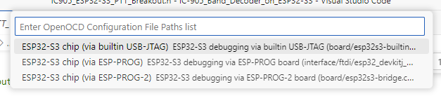
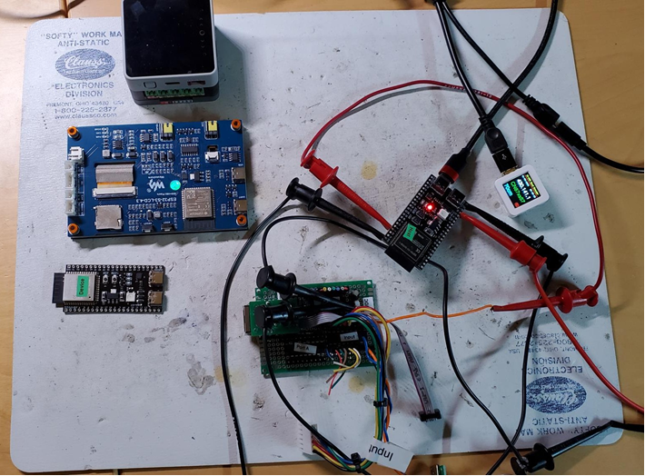
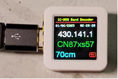
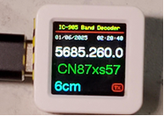

| Supported Targets | ESP32-S3 |
| ----------------- | -------- |

      Updated January 5, 2025

      I looked at the PTT input and no debouce is required.  It is a transistor output and there is no trouble with it.  There is a 5V pullup in the radio, perfect for TTL logic including the ULN2803A I am using for a buffer device.  I measured 0.6ma driving a 2803A input direct.  It is good for 500ma continuous load on any one output, 600ma total package.

      I imported some of the 705 transverter code to support the M5Stack AtomsS3 and its small color LCD screen.  It is a single Type-C USB port that is capable of OTG host mode and has a 0.95" color graphics LCD display that is very bright and sharp so small text can stand out.  I wanted to try programming and using host mode on a single port device. This would allow selection of smaller ESP32-S3 modules saving room.  The display is also handy, better quality than the typical small OLEDs and I can fit all the useful info on a single screen, no need to rotate screens.  I have time, date, grid square (8-digits), band name, PTT TX status icon, and dial frequency displayed.  How to mount it requires some creativity though.  I have M5StampC3U and M5StampS3 modules that are very OTG capable and small, but still have many IO pins without needing an I2C expander chip.  We need 13 pins. 

      I plan to build this on a small single port module.  Debate welcome.  Cost is no difference.  It is easy to develop on a 2-port board then load it up on a single port target.  You just hold the reset button for several seconds and it changes to device mode for programming.  I figure most users are not going to modify the code for this, at least rarely, maybe only to set up custom output pin patterns.  Setting up the esp-idf dev environment is not likely going to fly for a non-developer so I plan to offer compiled images that can be flashed with minimal tooling required.  M5 has a standalone flash tool that I should be able to leverage.

      Prototype hardware plan for this week:
      1. Small black aluminum case, 100mm x 82mm x 27mm.  Has PCB slots, split body with end plates.  I have one with mounting flanges which is connenient but that is no longer available.  I plan to mount mine on the Peavy cage surrounding my 905 controller, it has lots of 1/4-20 threaded holes all over.
      2. 2x 12V coaxial jacks connected together to pass through 12V power to the 905.  If the decoder is mounted on the 905 controller then this is 1 less cable to unplug.
      3. Right-angle 15-pin HD D-Sub PCB-mount connector for 12 outputs.  For Band, PTT, and 1 PTT input line which will be in parallel with the phone jack.
      4. Phono jack for PTT input from the 905 SEND port. 
      5. The CPU USB port will stick out on one end plate.
      6. Debating puttig a power switch in.  Not sure it has a real use.
      7. Internal resettable poly fuse and reverse polarity diode.
      8. ULN2803A buffers (x2).

      Will cut a vectorboard to fit the case and hand wire it.  When it is finalized, and prove it all fits in, I can do a PCB layout and publishe the BOM.

      The decoder, USB and SEND cables, can stay attached to the radio and you can simply plug/unplug the 12V feed and HD15 cables for setup/teardown, leaving the USB abnd 12V cables between the decoder and controller in place. If the decoder is remote located then no issue, you have to extend the USB as required though.  I have a USB extender that works over a long 4-pair enet cable (not ethernet, just the same cable type.)

      I checked in code today that supports the M5AtomS3.  Has a single OTG USB port, works fine.  The 0.95" color LCD is sharp and easily shows useful information.  Band, grid, time, frequency, PTT.  
      
      To switch between the AtomS3 and other boards there is a #define AtomS3 near the top of the IC905_ESP32-S3_PTT_Breakout.cpp file.  After connecting to your computer, hold the AtomS3 reset button for > 3 seconds to put it into boot mode.  In the IDE change to ESP32S3 and choose the built-in-JTAG option.  For the dual port Dev-Kit-1 choose the last option Prog2.  See pic below.  I usally delete the build folder for a clean build.  sdkconfig sometinmes gets confused.  I keep all my changed config settings in the sdkconfig.defaults file.  

      

      

      

      

I also added in CI_V address config and VID/PIDs for the IC-705 and IC-9700.  It works on the 705 as long as you stay on the 144 and 430 bands.  I stripped support for the lower bands from the code I imported from the 705 project since I was targeting the 905.  I will likely revisit that decision.  I do not have an IC-9700 to test with so are waiting for feedback.


# USB Band Decoder for the IC-905

This is a Band Decoder and PTT Breakout for the IC-905 radio.  It plugs into the IC-905 USB port and communicates with the radio using CI-V serial protocol to extract frequency (for band), time, date, location (for grid square calcuation), and extended mode info (data and voice mode).  

It provides:
* 6 band outputs for switching antenna relays, enabling RF amps, etc.
* 6 PTT outputs for keying amplifiers
* 1 PTT input (wired to the radio SEND jack)

By default each band (there are 6) is configured to operate one Band output pin and 1 PTT output pin in TX.  Also by default the PTT input is pulled high during RX to 3.3VDC and looks for 0V for TX.  A buffer should be used to protect against high voltages > 3.3V. 

The PTT output pin(s) are set to logic 1 (3.3VDC) to operate a buffer which usually inverts the signal thus closing the buffer output to GND, the most common for external amplifiers.  PTT polarity is easily changed in the code if needed. Debouncing the PTT Input is not required since the radio has a transistor SEND output switch so it is clean.  The flex_glitch filter does not apply to the S3 but I did apply the fixed glitch filter (2 clocks).

In the near future I will support a 128x32 OLED display with PTT, band, time, date, and grid status.  LEDs may be placed on the outputs and input as well, TBD.   

In a more distant future I may make this work over USB and BLE (Bluetooth Low Energy) for an IC-705 with transverter support.  This already exists in my other projects but this project will have a PCB designed for it, making it a bit more convenient for some.

This codes started out with the esp-idf peripherals example for cdc-acm usb host lib.  I added in bits for GPIO with interrupts from other samples and chunks of my other IC-705/IC-905 band decoder projects.  This project differs from my others in that is it intended to be a small box with PCB and narrowly focused on being a basic 6 band decoder.  The others go further with graphics screen, transverter support and flexible IO choices.


## How to use example

Connect the USB-UART (labeled com port on some boards) to your PC.  Connect the USB-OTG port to the IC-905.  Upload precompiled firmware per instructions on the Wiki page (under  construction).  If you can successfully set up the Expressif ESP-IDF extension in Visual Studio Code then you can build this repository locally and upload.  You can use any serial monitor (putty, Arduino, esp-idf) to monitor the debug info on the com port.  

You can also take 2 boards and connect their USB-OTG ports together using a Type C to Type C USB cable.  On one, designated the 'Device", run the tusb-serial-device example.  On the other run this code.  This code is configured to look for 2 possible USB VID and PID (vendor and Product IDs) so will connect with either a radio or the ESP32-S3 DevKit 1 device.   When things are working you will see the debug with the correct frequency and you can put a voltmeter on the board IO pins and see 0V and 3.3V per the pin assignments.


### Hardware Required

You will need one ESP32-S3 board which is capable of USB-OTG support.  Some other boards support USB-OTG as well. The easiest way to develop and test is to use a model with 2 USB ports, one port for OTG (operating in USB Host mode) and the other port (USB-UART) to program and debug the board.

I used 2 board models, one with Host 5V and a 4.3" LCD screen, the other a small module with no screen and you need to have a Y cable to siupply +5VDc on the USB host bus port.  ESP32-S3 devices here that support OTG and have a second USB port for debug and programming.  Will need to settle on the final device to use.

What I used:

ESP32-S3-DevKit N16R8 Development Board - small module with 2 ports. About $7 each.  You need to add 5V with a Y cable or jumper to USB or external 5V to power the client device (radio or another test board).  There are many variations that will work, most important is the ESP32-S3 and the 2 USB ports, one OTG.

https://docs.espressif.com/projects/esp-dev-kits/en/latest/esp32s3/esp32-s3-devkitm-1/user_guide.html#getting-started

https://docs.espressif.com/projects/esp-dev-kits/en/latest/esp32s3/esp32-s3-devkitc-1/user_guide.html

These have no screen and no Type A host port, but still have 2 USB ports, one is OTG.  Has WiFi and Bluetooth Low Energy (BLE).

I have this one on order and plan to test with.  ESP32-S3-USB-OTG Development Board.  About $35.

https://docs.espressif.com/projects/esp-dev-kits/en/latest/esp32s3/esp32-s3-usb-otg/user_guide.html

This uses a ESP32-S3-Mini module stacked on a like-sized motherboard with a 1.3” LCD and 2 USB connectors. One is a USB Type A female host that provides 5V@500ma and the other a USB Type A male to connect to a PC.

I have M5Stack M5StampS3 and M5StackC3U CPU modules, about $7 each, they support USB OTG but ony come with 1 USB port. You can connect to the 2nd port for USB with some wiring.  Once the code is uploaded over the single OTG port in boot mode, it will run the new firmware and go into OTG host mode to tallk to the radio.  I plan to test with this in the near future.

I have an 800x480 LCD ESP32-S3 OTG dev kit version from Waveshare with 2 USB ports, one 5V powered OTG, that works well also scien it provides the needed 5V.  About $35.

One CPU in particular I might try out is the M5stack M5AtomS3.  It has a 0.95" color LCD, one OTG port. It looks pretty good and is very small yet readable, I use it on my 705 decoder. Adding i2c connector IO expansion is easy, just a 4-wire cable that plugs in.  The hard part is how to mount it in a box. 

The advantage of the boards that provide built-in 5V is they are, or should be, done properly with a fuse and/or current limiting device so you do not cook the client device in a mishap.  The biggest feature is no Y cable!

Speaking of cables, do yourself a favor and inventory your Type C cables.  C to C and A to C.  Test them to be sure they are not charging-only cables!  Mark them if they charging only, it will save you grief!   I found I had 2 of these I was using and spent hours fixing unbroken or partially broken software. Easily missed if you are switching cables a lot while testing and do not have working software to star with and thus know what to blame.  I also lacked 18" cables.  They are all 6" or 6ft.  Creates a cable mess. I ordered 3-packs of 18" cables, much better on my desktop now.  


#### Pin Assignment

The pins are defined in the decoder.h file. There are 13 pins used.  1 for PTT input.  6 Band decode outputs and 6 for PTT outputs.  You can change the pin numbers no problem as long as they are not used for something else. There is no need to change any other code, the pin assignments are abstracted.


### Build and Flash

Build this project using the esp-idf extension in VS Code and flash it to the USB OTG host board, then run monitor tool to view serial output. There are some settings that have to be made located in the sdkconfig file for hub support and packet size.  YOu can edit it or use menuconfig tool.

Below are the OTG related settings. I modify or enable these.  They are sometimes lost if you start the Setup Configure Extension wizard.  I included in the repository here 'sdkconfig.defaults' file which has these.  In theory it will help ensure you do not lose these values.

      CONFIG_USB_HOST_CONTROL_TRANSFER_MAX_SIZE = 2048   --> if you see errors this is usually the culprit, default of 256 is too small for hubs.
      CONFIG_USB_HOST_HUBS_SUPPORTED=y     --> If you see you cannot open the radio and it is connected, this is likely not set
      CONFIG_USB_OTG_SUPPORTED=y   --> usually already set.

      #
      # USB-OTG
      #
      CONFIG_USB_HOST_CONTROL_TRANSFER_MAX_SIZE=2048
      CONFIG_USB_HOST_HW_BUFFER_BIAS_BALANCED=y
      # CONFIG_USB_HOST_HW_BUFFER_BIAS_IN is not set
      # CONFIG_USB_HOST_HW_BUFFER_BIAS_PERIODIC_OUT is not set
      
      #
      # Hub Driver Configuration
      #
      
      #
      # Root Port configuration
      #
      CONFIG_USB_HOST_DEBOUNCE_DELAY_MS=250
      CONFIG_USB_HOST_RESET_HOLD_MS=30
      CONFIG_USB_HOST_RESET_RECOVERY_MS=30
      CONFIG_USB_HOST_SET_ADDR_RECOVERY_MS=10
      # end of Root Port configuration
      
      CONFIG_USB_HOST_HUBS_SUPPORTED=y
      CONFIG_USB_HOST_HUB_MULTI_LEVEL=y
      
      #
      # Downstream Port configuration
      #
      CONFIG_USB_HOST_EXT_PORT_RESET_RECOVERY_DELAY_MS=30
      # CONFIG_USB_HOST_EXT_PORT_CUSTOM_POWER_ON_DELAY_ENABLE is not set
      # end of Downstream Port configuration
      # end of Hub Driver Configuration
      
      # CONFIG_USB_HOST_ENABLE_ENUM_FILTER_CALLBACK is not set
      CONFIG_USB_OTG_SUPPORTED=y
      # end of USB-OTG


If using one board for a device rather than the radio, build and flash [tusb_serial_device example](../../../device/tusb_serial_device) to USB device board.  It does not have to be a OTG capable board, just a ESP32 with 1 free USB port.

See the ESP-IDF Getting Started Guide for full steps to configure and use ESP-IDF to build projects.

## Example Output

After the flashing you should see the output at idf monitor:

```
...
I (256) USB-CDC: USB Host installed
I (256) USB-CDC: Opening CDC ACM device 0x303A:0x4001
...
Device descriptor is printed here
...
I (1666) USB-CDC: Data received
I (1666) USB-CDC: 0x3ffc4c20   41 54 0d                                          |AT.|
I (2666) USB-CDC: Data received
I (2666) USB-CDC: 0x3ffc4c20   41 54 2b 47 53 4e 0d                              |AT+GSN.|
I (3666) USB-CDC: Setting up line coding
I (3666) USB-CDC: Line Get: Rate: 115200, Stop bits: 0, Parity: 0, Databits: 8
I (3666) USB-CDC: Line Set: Rate: 9600, Stop bits: 1, Parity: 1, Databits: 7
I (3666) USB-CDC: Line Get: Rate: 9600, Stop bits: 1, Parity: 1, Databits: 7
I (3676) Example finished successfully!
...
Various Hex data and debug messages follow.  

The firmware will poll the radio on startup for time, data, location, time offset, frequency, and mode.
It will also poll the radio for extended mode information when you change bands or modes since the standard mode message omits the Datamode status.

Wiki Pages will contain more as I get further along in this effort.

I hope to soon design a PCB to mount the CPU module of choice, buffers, jacks, LEDS if used, and an optional OLED display.  It would have a 12V to 5V regulator and a 12V 2.1mm x 5.5mm standard coaxial DC power jack, maybe a power switch.  There will be connectors for the outputs and input. They could be 13 phono (aka RCA) jacks or possibly a high density connector of some sort.  I like the green ones with push-in or screw terminals.  There are also DB9 and HD9 breakouts with screw terminals on a snmall PCB that use the same green terminals.
